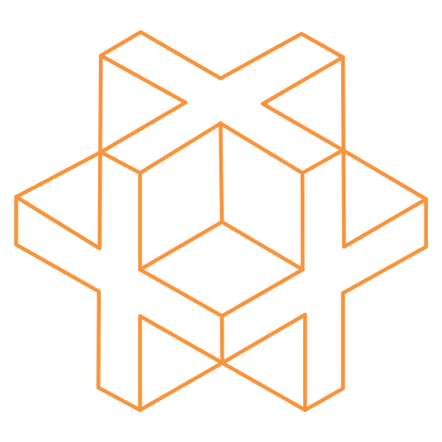
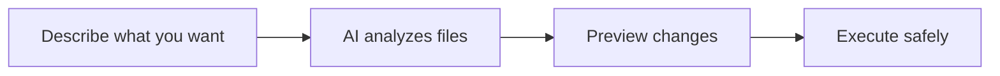

<p align="center">
  
</p>

<h1 align="center">Sentinel</h1>

<p align="center">
  <strong>AI-powered file manager that actually understands your files</strong>
</p>

<p align="center">
  <a href="https://github.com/lilfourn/sentinel/stargazers">
    
  </a>
  <a href="https://github.com/lilfourn/sentinel/network/members">
    
  </a>
  <a href="https://github.com/lilfourn/sentinel/issues">
    
  </a>
  <a href="https://github.com/lilfourn/sentinel/blob/main/LICENSE">
    
  </a>
</p>

<p align="center">
  <a href="#the-story">The Story</a> •
  <a href="#features">Features</a> •
  <a href="#use-cases">Use Cases</a> •
  <a href="#quick-start">Quick Start</a> •
  <a href="#architecture">Architecture</a> •
  <a href="#contributing">Contributing</a>
</p>

<p align="center">
  
  
  
</p>

---

## The Story

**I built Sentinel for my Dad.**

My father has been accumulating digital files for over 20 years—thousands of photos, documents, receipts, and project files scattered across dozens of folders with names like "New Folder (47)" and "Misc Stuff 2019". Every time he needed to find something, it turned into a multi-hour archaeology expedition.

I'm a Computer Science student at **The University of Texas at Austin**, and I thought: *what if AI could actually understand what files are about—not just their names, but their contents—and organize them intelligently?*

So I built Sentinel. Now my Dad can point it at any messy folder, describe in plain English how he wants things organized, and watch as it builds a complete reorganization plan. He previews every change before anything moves. No more lost files. No more digital chaos.

**This project is open source because I believe everyone deserves a smarter way to manage their files.** If you find it useful, I'd love your help making it better.

---

## Features

### Conversational File Intelligence

Ask questions about your files in plain English. Sentinel reads and understands file contents—not just names.

```
You: What files relate to the Henderson project?

Sentinel: Found 12 files across 3 folders:
  📄 /Documents/Contracts/henderson-agreement.pdf
  📁 /Projects/Henderson/specs.docx
  💰 /Downloads/henderson-invoice-*.pdf (3 files)
  ...
```

### Autonomous Organization

Describe your ideal folder structure. Sentinel analyzes everything and builds a complete plan.

```
You: Organize by project, separate invoices and contracts

Sentinel: Creating structure:
  📁 Projects/
    📁 Henderson/
      📁 Invoices/
      📁 Contracts/
    📁 Acme/
      📁 Invoices/
      ...
  Moving 847 files. Ready to preview?
```

### Safe Preview System

Every operation simulates in a virtual filesystem first. See exactly what will happen—highlighted files, new folders, potential conflicts—before a single byte moves.

### Crash Recovery

All operations journal before execution. If your machine crashes mid-reorganization, Sentinel picks up where it left off or rolls back cleanly.

### Semantic Search

Find files by meaning, not just keywords. Searching "tax documents" finds `1040.pdf`, `w2-2024.pdf`, and `quarterly-estimated.xlsx`—even without "tax" in the filename.

---

## Use Cases

### For Professionals

| Scenario | How Sentinel Helps |
|----------|-------------------|
| **Accountants** | Organize client documents by year, type, and status |
| **Photographers** | Sort thousands of photos by event, date, or subject |
| **Lawyers** | Structure case files with contracts, correspondence, evidence |
| **Researchers** | Categorize papers, datasets, and notes by project |
| **Consultants** | Maintain client folders with deliverables and invoices |

### For Everyone

| Problem | Solution |
|---------|----------|
| "I can't find that receipt from last year" | Semantic search: "find receipts from 2024" |
| "My Downloads folder is chaos" | "Organize by type: documents, images, installers" |
| "I have duplicates everywhere" | "Find duplicate files and move to review folder" |
| "I need to clean up before running out of space" | "Show me the largest files I haven't opened in 6 months" |

### Real Examples

**Photographer's nightmare:**
```
Before: IMG_0001.jpg through IMG_5000.jpg in one folder
After: Organized by date and event with descriptive names
```

**Tax season panic:**
```
You: Find everything I need for my 2024 taxes
Sentinel: Found 23 relevant documents including W-2s, 1099s,
         receipts, and charitable donation records
```

**Project handoff:**
```
You: Organize the Henderson project for client delivery
Sentinel: Creating delivery structure with Final Documents,
         Supporting Materials, and Invoice History folders
```

---

## Quick Start

### Prerequisites

- [Rust](https://www.rust-lang.org/tools/install) (1.70+)
- [Node.js](https://nodejs.org/) (18+)
- [Anthropic API Key](https://console.anthropic.com/)

### Installation

```bash
# Clone the repository
git clone https://github.com/lilfourn/sentinel.git
cd sentinel

# Install dependencies
npm install

# Run in development mode
npm run tauri dev
```

### First Run

1. Launch Sentinel
2. Click the gear icon → Settings
3. Enter your Anthropic API key
4. Navigate to any folder and start organizing!

---

## How It Works



### The Pipeline

1. **Intelligent Sampling** — For large folders, Sentinel samples strategically rather than processing every file. A 10,000-file folder uses the same context as 100 files.

2. **Rule Generation** — Claude analyzes samples and generates matching rules:
   ```
   file.ext IN ['pdf', 'docx'] AND file.name.contains('invoice')
   file.vector_similarity('tax document') > 0.7
   ```

3. **Coverage Iteration** — Rules apply iteratively until 95%+ files are covered.

4. **Virtual Simulation** — All operations stage in memory. Conflicts surface before execution.

5. **Safe Execution** — Operations journal to a write-ahead log, then run in parallel via dependency DAG.

---

## Architecture

```
┌─────────────────────────────────────────────────────────────┐
│                    Frontend (React 19)                       │
├──────────────────┬──────────────────┬───────────────────────┤
│ ChatPanel        │ Stores (Zustand) │ File Views            │
│ - Streaming      │ - chat-store     │ - Grid/List/Columns   │
│ - Tool viz       │ - organize-store │ - Drag & Drop         │
│ - @mentions      │ - vfs-store      │ - Preview Overlay     │
└──────────────────┴──────────────────┴───────────────────────┘
                            │ Tauri IPC
                            ▼
┌─────────────────────────────────────────────────────────────┐
│                   Backend (Rust + Tauri v2)                  │
├──────────────────┬──────────────────┬───────────────────────┤
│ AI Agents        │ Safety Systems   │ Search                │
│ - Chat (ReAct)   │ - Virtual FS     │ - Vector embeddings   │
│ - Organize       │ - Write-Ahead Log│ - Semantic similarity │
│ - Rule Engine    │ - DAG Executor   │ - Content indexing    │
└──────────────────┴──────────────────┴───────────────────────┘
                            │ HTTPS
                            ▼
┌─────────────────────────────────────────────────────────────┐
│                    Claude AI (Anthropic)                     │
│         Haiku (fast) │ Sonnet (planning) │ Opus (reasoning) │
└─────────────────────────────────────────────────────────────┘
```

### Key Components

| Component | Purpose |
|-----------|---------|
| **Chat Agent** | ReAct loop with tools: search, read, inspect, list |
| **Organize Agent** | Multi-phase planner with iterative rule refinement |
| **Virtual FS** | In-memory shadow filesystem for safe preview |
| **WAL** | Crash recovery via journaled operations |
| **DAG Executor** | Parallel execution respecting dependencies |
| **Vector Index** | Local embeddings for semantic search |

---

## Tech Stack

### Frontend
| Technology | Purpose |
|------------|---------|
| React 19 | UI framework |
| TypeScript | Type safety |
| Vite 7 | Build tool |
| TailwindCSS 4 | Styling |
| Zustand | State management |
| TanStack Query | Async state |

### Backend
| Technology | Purpose |
|------------|---------|
| Tauri 2 | Desktop runtime |
| Rust | Backend logic |
| tokio | Async runtime |
| fastembed | Local embeddings |
| petgraph | DAG operations |

### AI Models
| Model | Use Case |
|-------|----------|
| Claude Haiku | Fast exploration |
| Claude Sonnet | Planning & rules |
| Claude Opus | Complex reasoning |

---

## Contributing

**I need your help to make Sentinel better!**

This started as a personal project for my Dad, but I believe it can help millions of people struggling with digital clutter. Whether you're a seasoned developer or just getting started, there are many ways to contribute:

### Ways to Help

- **Report bugs** — Found something broken? [Open an issue](https://github.com/lilfourn/sentinel/issues)
- **Suggest features** — Have an idea? I'd love to hear it
- **Improve docs** — Help others get started faster
- **Write code** — Check out [good first issues](https://github.com/lilfourn/sentinel/labels/good%20first%20issue)
- **Share** — Star the repo and tell others!

### Development

```bash
npm run tauri dev      # Development mode
npm run tauri build    # Production build
cargo check            # Rust type checking
cargo test             # Run tests
```

### Roadmap

- [ ] Multi-folder organization
- [ ] Custom rule templates
- [ ] Full undo history
- [ ] Plugin system
- [ ] Cloud sync for presets

---

## Star History

If Sentinel helps you, please consider giving it a star! It helps others discover the project.

<a href="https://star-history.com/#lilfourn/sentinel&Date">
 <picture>
   <source media="(prefers-color-scheme: dark)" srcset="https://api.star-history.com/svg?repos=lilfourn/sentinel&type=Date&theme=dark" />
   <source media="(prefers-color-scheme: light)" srcset="https://api.star-history.com/svg?repos=lilfourn/sentinel&type=Date" />
   
 </picture>
</a>

---

## About Me

<p align="center">
  
  
</p>

I'm **Luke Fournier**, a Computer Science student at **The University of Texas at Austin** graduating in 2026. I'm passionate about building tools that make people's lives easier.

**I'm actively looking for internship and full-time opportunities** in software engineering, particularly in:
- AI/ML applications
- Desktop and systems programming
- Developer tools and productivity software

<p align="center">
  <a href="https://www.linkedin.com/in/lukefournier711/">
    
  </a>
  <a href="https://github.com/lilfourn">
    
  </a>
  <a href="mailto:luke.fournier2023@gmail.com">
    
  </a>
</p>

---

## License

MIT — Use it, modify it, make it yours.

---

<p align="center">
  <sub>Built with late nights, lots of coffee, and love for my Dad</sub>
</p>

<p align="center">
  <a href="https://tauri.app"></a>
  <a href="https://anthropic.com"></a>
  <a href="https://rust-lang.org"></a>
  <a href="https://react.dev"></a>
</p>
