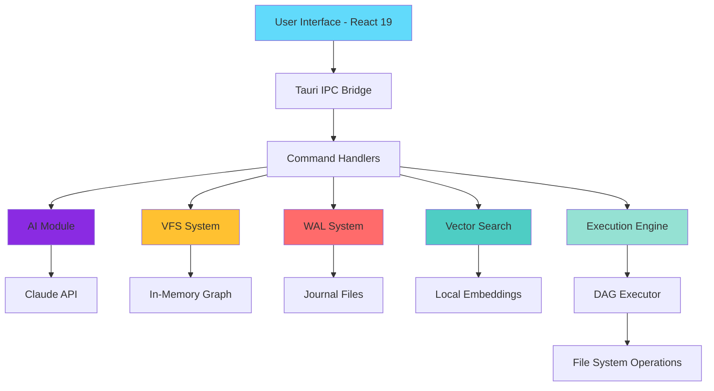
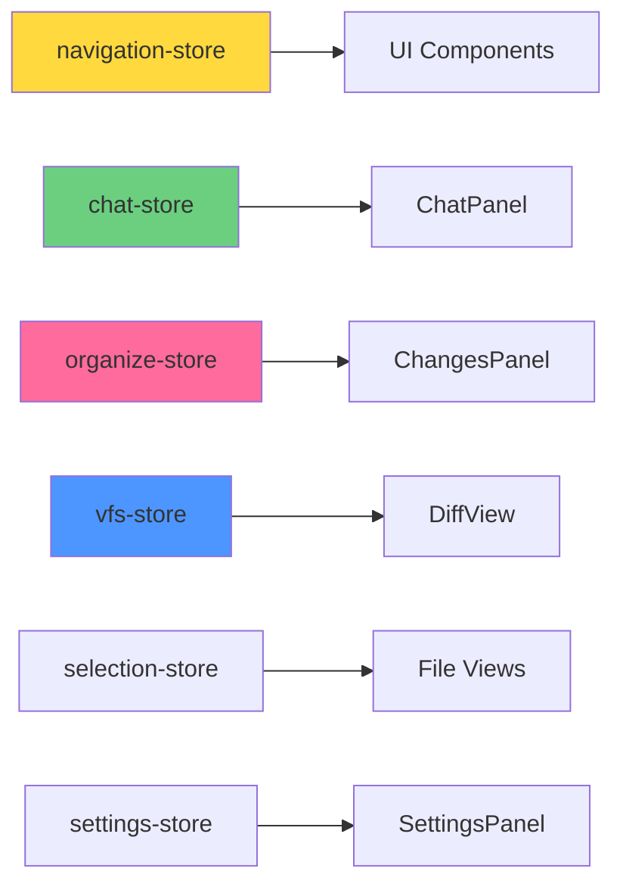
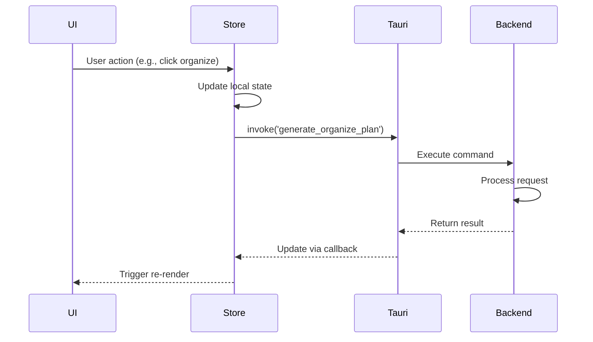
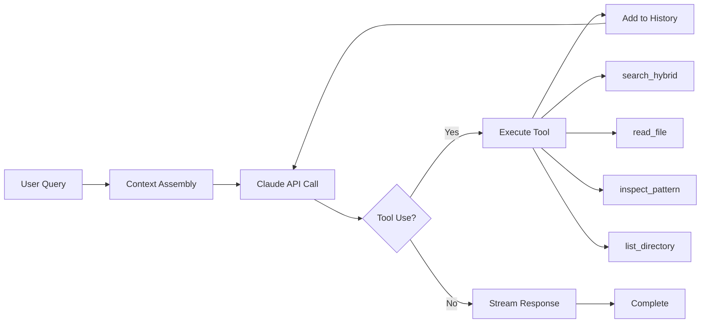
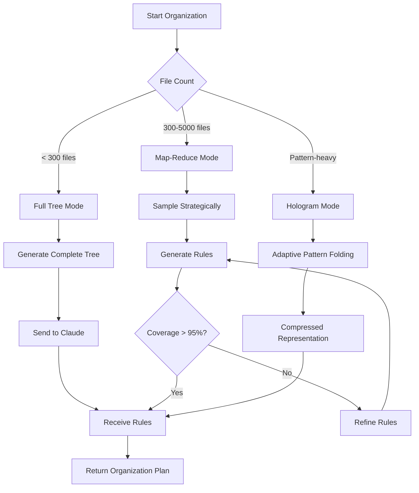
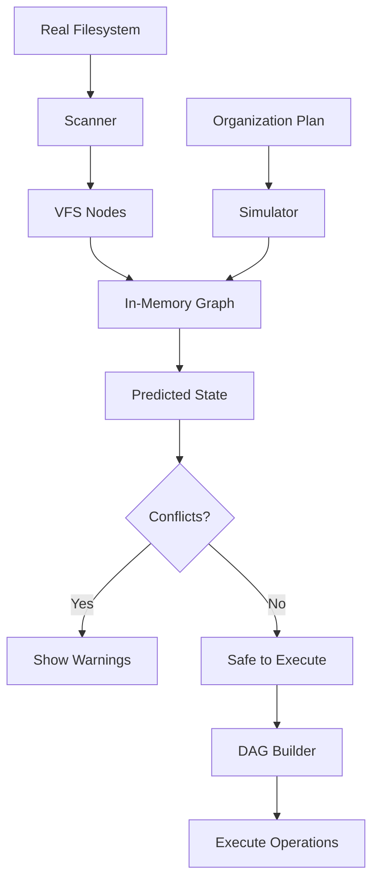
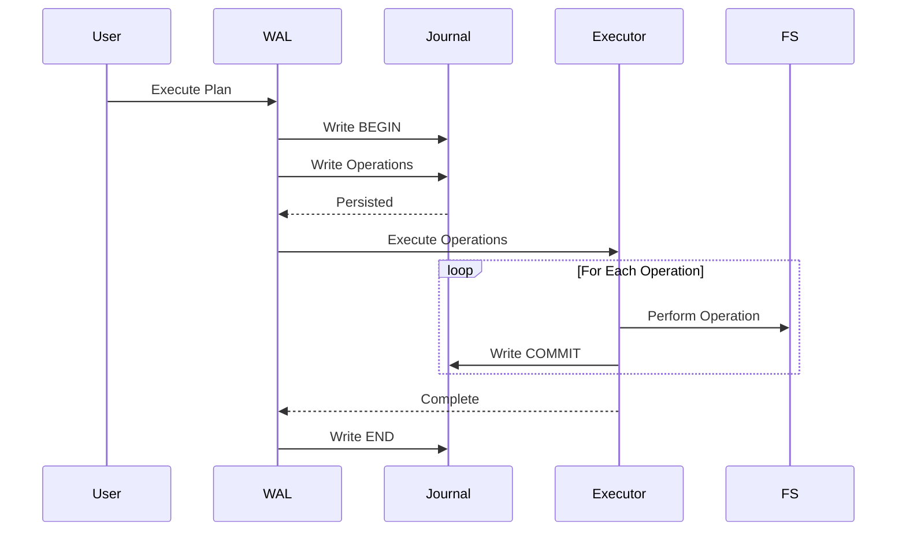
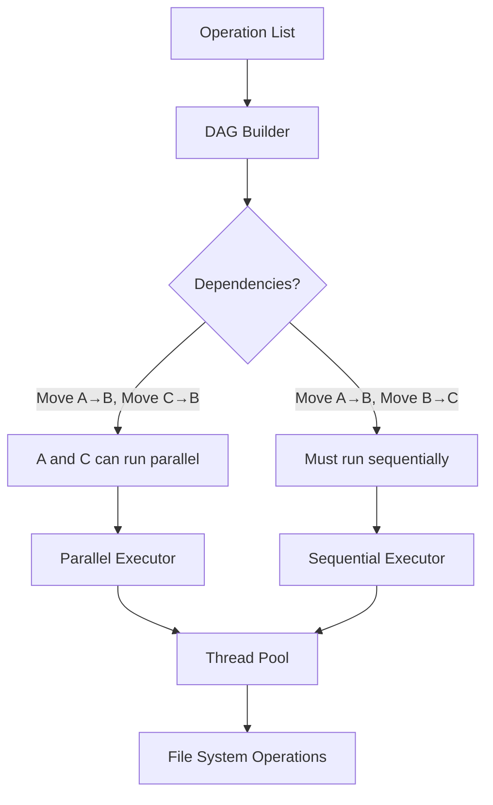
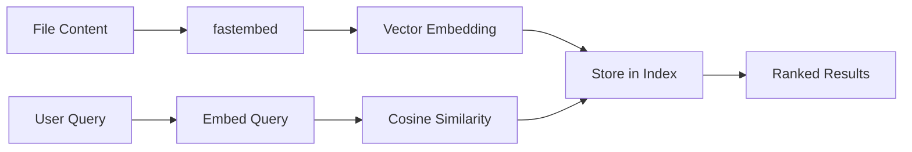
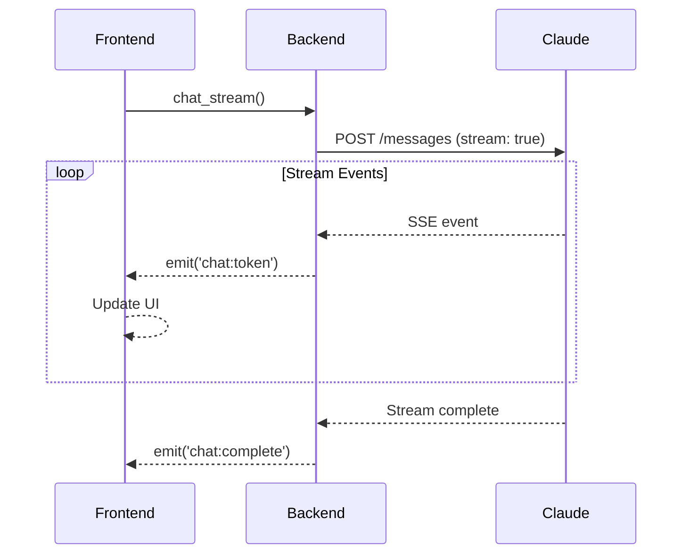

# Architecture

This document describes Sentinel's architecture, design patterns, and component interactions.

## System Overview

Sentinel follows a layered architecture with clear separation between the UI layer (React), business logic layer (Tauri commands), and core systems (AI, VFS, WAL, Vector Search).



## Frontend Architecture

### Component Hierarchy

```
App.tsx
├── Layout
│   ├── Sidebar (navigation, favorites)
│   ├── FileExplorer (main view)
│   │   ├── FileGridView
│   │   ├── FileListView
│   │   └── FileColumnsView
│   ├── ChatPanel (AI conversation)
│   │   ├── MessageList
│   │   ├── ChatInput
│   │   └── ThoughtAccordion
│   └── ChangesPanel (organization UI)
│       ├── PhaseIndicator
│       ├── PlanPreview
│       └── ExecutionProgress
└── Dialogs & Overlays
    ├── SettingsPanel
    ├── PlanEditModal
    ├── ConfirmDialog
    └── Toast notifications
```

### State Management (Zustand)

Sentinel uses Zustand for state management with domain-specific stores:



#### Store Responsibilities

| Store | Purpose | Key State |
|-------|---------|-----------|
| `navigation-store` | Directory navigation, history, view mode | `currentDir`, `history`, `viewMode` |
| `chat-store` | Chat messages, streaming, model selection | `messages`, `isStreaming`, `model` |
| `organize-store` | Organization workflow state machine | `phase`, `plan`, `progress` |
| `vfs-store` | Virtual filesystem preview | `nodes`, `operations`, `conflicts` |
| `selection-store` | Multi-file selection | `selectedPaths`, `isSelecting` |
| `ghost-store` | File operation animations | `ghosts`, `activeAnimations` |
| `settings-store` | User preferences, API keys | `apiKey`, `defaultModel`, `theme` |
| `history-store` | Operation history, undo/redo | `operations`, `undoStack` |

### Data Flow Pattern



## Backend Architecture

### Module Organization

```
src-tauri/src/
├── commands/          # Tauri command handlers (IPC entry points)
│   ├── ai.rs         # AI organization commands
│   ├── chat.rs       # Chat agent commands
│   ├── filesystem.rs # File operations
│   ├── vfs.rs        # Virtual filesystem commands
│   ├── wal.rs        # Write-ahead log commands
│   └── jobs.rs       # Job management
│
├── ai/               # AI integration and agents
│   ├── chat/         # Chat agent (ReAct loop)
│   ├── v2/           # Organization agent (V2/V4/V5)
│   ├── rules/        # DSL rule engine
│   └── client.rs     # Claude API client
│
├── vfs/              # Virtual filesystem
│   ├── node.rs       # VFS node representation
│   ├── graph.rs      # In-memory graph
│   ├── simulator.rs  # Operation simulator
│   └── scanner.rs    # Directory scanner
│
├── wal/              # Write-ahead log
│   ├── journal.rs    # Journal writing
│   ├── recovery.rs   # Crash recovery
│   ├── entry.rs      # Entry types
│   └── io.rs         # File I/O
│
├── execution/        # Execution engine
│   ├── dag.rs        # DAG construction
│   ├── executor.rs   # Parallel executor
│   └── state_validator.rs # Pre-execution validation
│
├── vector/           # Vector search
│   └── mod.rs        # Embedding generation and search
│
└── models/           # Shared data models
    └── file.rs       # File metadata structures
```

### AI Module Design

The AI module supports two primary agents with different execution models:

#### Chat Agent (ReAct Loop)



**Features:**
- Max 8 iterations with 500ms rate limiting
- Extended thinking mode (128K token budget)
- Streaming via SSE parsing
- Tool execution: search, read, inspect, list

#### Organization Agent (V2/V4/V5)

The organization agent adapts its strategy based on folder size:



**Optimization Techniques:**
1. **Prompt Caching** - Reuse system prompts across API calls
2. **Model Escalation** - Start with Haiku, escalate to Sonnet if needed
3. **Hologram Compression** - Adaptive XML pattern folding (85-94% token savings)
4. **Map-Reduce** - Iterative rule refinement for large folders

### Virtual File System (VFS)

The VFS maintains an in-memory graph representation of the filesystem for safe preview:



**VFS Node Structure:**
```rust
pub struct VfsNode {
    pub path: PathBuf,
    pub name: String,
    pub is_dir: bool,
    pub size: u64,
    pub modified: SystemTime,
    pub children: Vec<PathBuf>,
    pub state: NodeState, // Original | Created | Modified | Deleted
}
```

### Write-Ahead Log (WAL)

The WAL provides crash recovery through journaled operations:



**Journal Entry Types:**
```rust
pub enum WalEntry {
    Begin { job_id: String, timestamp: i64 },
    Operation { op_type: String, source: PathBuf, dest: Option<PathBuf> },
    Commit { op_index: usize },
    End { job_id: String },
}
```

**Recovery Process:**
1. On startup, scan for incomplete journals
2. If found, show recovery banner
3. User chooses: Resume or Rollback
4. Resume: Re-execute uncommitted operations
5. Rollback: Reverse committed operations

### Execution Engine

The execution engine builds a dependency DAG for parallel operation:



**DAG Construction:**
```rust
pub struct ExecutionDag {
    pub graph: DiGraph<Operation, ()>,
    pub node_map: HashMap<String, NodeIndex>,
}

// Dependencies detected:
// - Path conflicts (same source/dest)
// - Parent-child relationships (must create parent before child)
// - Sequential constraints (user-specified order)
```

### Vector Search

Local embeddings enable semantic search without API calls:



**Embedding Model:** `BAAI/bge-small-en-v1.5` (384 dimensions)

**Search Flow:**
1. Extract text from files (PDF, DOCX, TXT, etc.)
2. Generate embeddings locally via fastembed
3. Store embeddings with file metadata
4. For queries: Embed query → Compute similarity → Return top-k

## Communication Patterns

### Tauri IPC (Frontend ↔ Backend)

```typescript
// Frontend: Invoke command
const result = await invoke<OrganizePlan>('generate_organize_plan_hybrid', {
  path: '/Users/me/Documents',
  instruction: 'Organize by project'
});

// Backend: Command handler
#[tauri::command]
async fn generate_organize_plan_hybrid(
    path: String,
    instruction: String,
) -> Result<OrganizePlan, String> {
    // Implementation
}
```

### Event System (Backend → Frontend)

```typescript
// Frontend: Listen for events
await listen<TokenEvent>('chat:token', (event) => {
  appendToMessage(event.payload.content);
});

// Backend: Emit events
app.emit_all("chat:token", TokenPayload {
    content: "Hello".to_string(),
}).unwrap();
```

### Streaming Responses

Chat uses SSE streaming for real-time updates:



## Security & Safety

### Sandboxed Shell Execution

```rust
// Whitelist approach for AI tool execution
pub const ALLOWED_COMMANDS: &[&str] = &[
    "find", "ls", "grep", "cat", "head", "tail", "wc", "file"
];

pub fn validate_command(cmd: &str) -> Result<(), String> {
    let parts: Vec<&str> = cmd.split_whitespace().collect();
    let base_cmd = parts.get(0).ok_or("Empty command")?;

    if !ALLOWED_COMMANDS.contains(base_cmd) {
        return Err(format!("Command '{}' not allowed", base_cmd));
    }

    // Prevent path traversal, injection, etc.
    validate_arguments(&parts[1..])?;
    Ok(())
}
```

### Cycle Detection

Before execution, detect circular dependencies:

```rust
pub fn detect_cycles(operations: &[Operation]) -> Result<(), String> {
    let mut visited = HashSet::new();
    let mut stack = HashSet::new();

    for op in operations {
        if has_cycle(op, &mut visited, &mut stack)? {
            return Err("Circular dependency detected".to_string());
        }
    }
    Ok(())
}
```

### File Coordination (macOS)

Uses `NSFileCoordinator` for safe concurrent access:

```rust
#[cfg(target_os = "macos")]
pub fn coordinated_move(source: &Path, dest: &Path) -> Result<(), Error> {
    // NSFileCoordinator ensures atomic operations
    // and coordination with other processes
    unsafe { /* objc2 bindings */ }
}
```

## Performance Optimizations

### 1. Parallel Directory Scanning

```rust
use jwalk::WalkDir;

pub fn scan_parallel(path: &Path) -> Vec<FileEntry> {
    WalkDir::new(path)
        .parallelism(jwalk::Parallelism::RayonNewPool(num_cpus::get()))
        .into_iter()
        .filter_map(|e| e.ok())
        .map(|entry| FileEntry::from(entry))
        .collect()
}
```

### 2. Prompt Caching

```rust
// Reuse system prompts across API calls
let mut messages = vec![
    Message {
        role: "system".into(),
        content: SYSTEM_PROMPT.into(), // Cached
    },
    Message {
        role: "user".into(),
        content: user_query, // Dynamic
    },
];
```

### 3. Hologram Compression

Adaptive XML pattern folding for large trees:

```xml
<!-- Before: 10,000 tokens -->
<files>
  <file>IMG_0001.jpg</file>
  <file>IMG_0002.jpg</file>
  <!-- ... 9998 more ... -->
</files>

<!-- After: 1,500 tokens (85% reduction) -->
<files pattern="IMG_####.jpg" count="10000" sample="IMG_0001.jpg,IMG_0500.jpg,IMG_9999.jpg"/>
```

### 4. Virtual Scrolling

Frontend uses TanStack Virtual for large file lists:

```typescript
import { useVirtualizer } from '@tanstack/react-virtual';

const virtualizer = useVirtualizer({
  count: files.length,
  getScrollElement: () => parentRef.current,
  estimateSize: () => 48, // Row height
  overscan: 5,
});
```

## Error Handling

### Rust Error Types

```rust
#[derive(Debug, thiserror::Error)]
pub enum SentinelError {
    #[error("File not found: {0}")]
    FileNotFound(String),

    #[error("AI API error: {0}")]
    AiError(String),

    #[error("VFS conflict: {0}")]
    VfsConflict(String),

    #[error("WAL recovery failed: {0}")]
    WalError(String),

    #[error(transparent)]
    IoError(#[from] std::io::Error),
}
```

### Frontend Error Boundaries

```typescript
class ErrorBoundary extends React.Component {
  componentDidCatch(error: Error, errorInfo: ErrorInfo) {
    // Log to error tracking service
    console.error('Component error:', error, errorInfo);

    // Show user-friendly message
    toast.error('Something went wrong. Please try again.');
  }
}
```

## Testing Strategy

### Backend Tests

```rust
#[cfg(test)]
mod tests {
    use super::*;
    use tempfile::TempDir;

    #[tokio::test]
    async fn test_vfs_simulation() {
        let temp = TempDir::new().unwrap();
        let mut vfs = Vfs::new();

        // Test operation simulation
        let plan = create_test_plan();
        let result = vfs.simulate(&plan).await;

        assert!(result.is_ok());
        assert_eq!(vfs.conflicts.len(), 0);
    }
}
```

### Frontend Tests

```typescript
import { render, screen } from '@testing-library/react';
import { describe, it, expect } from 'vitest';

describe('ChatPanel', () => {
  it('renders messages correctly', () => {
    render(<ChatPanel />);
    expect(screen.getByText(/send message/i)).toBeInTheDocument();
  });
});
```

## Deployment

### Build Process

```bash
# Frontend build
npm run build  # Vite builds to dist/

# Backend build
cd src-tauri
cargo build --release  # Optimized Rust binary

# Tauri build (combines both)
npm run tauri build  # Creates platform-specific installers
```

### Release Artifacts

- **macOS**: `.dmg` installer, `.app` bundle
- **Windows**: `.msi` installer, `.exe` portable
- **Linux**: `.deb`, `.AppImage`

### Auto-Updates

Uses `tauri-plugin-updater` for seamless updates:

```typescript
import { check } from '@tauri-apps/plugin-updater';

const update = await check();
if (update?.available) {
  await update.downloadAndInstall();
  await relaunch();
}
```

## Future Architecture Improvements

1. **Plugin System** - Allow third-party extensions
2. **Multi-folder Organization** - Handle multiple folders simultaneously
3. **Cloud Sync** - Sync settings and presets across devices
4. **Custom Rule Templates** - User-defined organization templates
5. **Full Undo History** - Complete operation reversal

---

**See Also:**
- [Frontend Documentation](./frontend/README.md)
- [Backend Documentation](./backend/README.md)
- [API Reference](./api/README.md)
