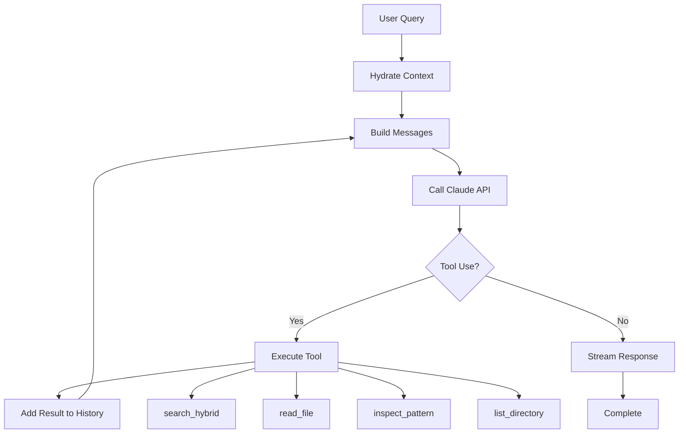
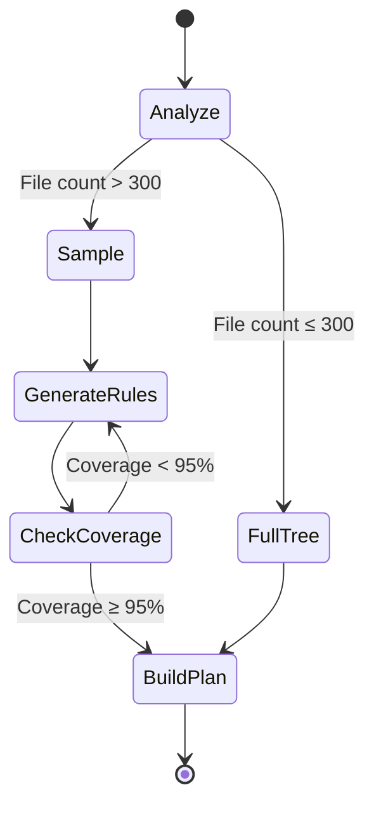

# Backend Documentation

This document covers Sentinel's Rust backend architecture, including Tauri commands, AI integration, safety systems, and core modules.

## Technology Stack

| Technology | Version | Purpose |
|------------|---------|---------|
| Tauri | 2.0 | Desktop framework and IPC bridge |
| Rust | 1.70+ | Backend logic and system operations |
| tokio | 1.0 | Async runtime |
| reqwest | 0.12 | HTTP client for AI APIs |
| fastembed | 4.0 | Local embeddings (no API required) |
| petgraph | 0.6 | DAG for parallel execution |
| notify | 7.0 | Filesystem watching |
| rusqlite | 0.32 | Content caching |

## Module Structure

```
src-tauri/src/
├── commands/              # Tauri command handlers (IPC entry points)
│   ├── ai.rs             # Organization commands
│   ├── chat.rs           # Chat agent commands
│   ├── filesystem.rs     # File operations
│   ├── vfs.rs            # Virtual filesystem commands
│   ├── wal.rs            # Write-ahead log commands
│   └── jobs.rs           # Job persistence
│
├── ai/                   # AI integration
│   ├── chat/            # Chat agent (ReAct loop)
│   │   ├── agent.rs     # Main agent loop
│   │   ├── tools.rs     # Tool definitions
│   │   ├── context.rs   # Context hydration
│   │   └── tests.rs     # Agent tests
│   │
│   ├── v2/              # Organization agent
│   │   ├── agent_loop.rs    # Main orchestration
│   │   ├── compression.rs   # Hologram compression
│   │   ├── analytics.rs     # Sampling strategies
│   │   └── tools.rs         # Organization tools
│   │
│   ├── rules/           # DSL rule engine
│   │   ├── parser.rs    # Rule parsing
│   │   └── evaluator.rs # Rule evaluation
│   │
│   ├── client.rs        # Claude API client
│   ├── credentials.rs   # Secure key storage
│   └── http_client.rs   # HTTP utilities
│
├── vfs/                 # Virtual filesystem
│   ├── node.rs          # VFS node structure
│   ├── graph.rs         # In-memory graph
│   ├── simulator.rs     # Operation simulator
│   └── scanner.rs       # Directory scanner
│
├── wal/                 # Write-ahead log
│   ├── journal.rs       # Journal writing
│   ├── recovery.rs      # Crash recovery
│   ├── entry.rs         # Entry types
│   └── io.rs            # File I/O
│
├── execution/           # Execution engine
│   ├── dag.rs           # DAG construction
│   ├── executor.rs      # Parallel executor
│   └── state_validator.rs # Pre-execution validation
│
├── vector/              # Vector search
│   └── mod.rs           # Embeddings and search
│
├── security/            # Security modules
│   ├── command_sandbox.rs   # Shell sandboxing
│   ├── cycle_detection.rs   # Cycle prevention
│   └── regex_validator.rs   # Input validation
│
├── history/             # Operation history
│   └── store.rs         # History persistence
│
└── models/              # Data models
    └── file.rs          # File metadata
```

## Command Handlers

Command handlers are the IPC entry points from the frontend.

### Chat Commands

**File**: `src-tauri/src/commands/chat.rs`

#### `chat_stream`

Streams chat responses with ReAct tool execution.

```rust
#[tauri::command]
pub async fn chat_stream(
    app: AppHandle,
    message: String,
    context_items: Vec<ContextItem>,
    model: String,
    extended_thinking: bool,
) -> Result<String, String> {
    // Initialize agent with context
    let agent = ChatAgent::new(app.clone());

    // Run ReAct loop with streaming
    agent.run_stream(message, context_items, model, extended_thinking).await
}
```

**Events Emitted:**
- `chat:token` - Streaming response chunks
- `chat:thinking` - Extended thinking updates
- `chat:thought` - Tool execution steps

**Example:**
```typescript
// Frontend
await invoke('chat_stream', {
  message: 'What files relate to taxes?',
  contextItems: [],
  model: 'claude-sonnet-4.5',
  extendedThinking: true,
});

// Backend emits events during execution
```

#### `abort_chat`

Cancels an active chat stream.

```rust
#[tauri::command]
pub async fn abort_chat() -> Result<(), String> {
    ABORT_FLAG.store(true, Ordering::SeqCst);
    Ok(())
}
```

### AI Organization Commands

**File**: `src-tauri/src/commands/ai.rs`

#### `generate_organize_plan_hybrid`

Generates an organization plan using adaptive strategies.

```rust
#[tauri::command]
pub async fn generate_organize_plan_hybrid(
    app: AppHandle,
    path: String,
    instruction: String,
    model: Option<String>,
) -> Result<OrganizePlan, String> {
    // Scan directory
    let files = scan_directory(&path).await?;

    // Choose strategy based on size
    let strategy = if files.len() < 300 {
        Strategy::FullTree
    } else if files.len() < 5000 {
        Strategy::MapReduce
    } else {
        Strategy::Hologram
    };

    // Generate plan with chosen strategy
    let agent = OrganizeAgent::new(app, strategy);
    agent.generate_plan(path, instruction, files, model).await
}
```

**Strategy Selection:**
| File Count | Strategy | Description |
|------------|----------|-------------|
| < 300 | Full Tree | Complete compressed tree sent to Claude |
| 300-5000 | Map-Reduce | Iterative rule refinement |
| 5000+ | Hologram | Adaptive pattern folding |

### Virtual Filesystem Commands

**File**: `src-tauri/src/commands/vfs.rs`

#### `vfs_simulate_plan`

Simulates a plan in the virtual filesystem.

```rust
#[tauri::command]
pub async fn vfs_simulate_plan(
    plan: OrganizePlan,
) -> Result<VfsSimulationResult, String> {
    let mut vfs = Vfs::new();

    // Load real filesystem state
    vfs.load_from_path(&plan.source_path).await?;

    // Simulate all operations
    for op in &plan.operations {
        vfs.simulate_operation(op)?;
    }

    // Detect conflicts
    let conflicts = vfs.detect_conflicts();

    Ok(VfsSimulationResult {
        nodes: vfs.nodes,
        conflicts,
        stats: vfs.compute_stats(),
    })
}
```

**Returns:**
```rust
pub struct VfsSimulationResult {
    pub nodes: HashMap<String, VfsNode>,
    pub conflicts: Vec<Conflict>,
    pub stats: VfsStats,
}

pub enum Conflict {
    PathCollision { path: String, sources: Vec<String> },
    CircularDependency { cycle: Vec<String> },
    MissingParent { child: String, parent: String },
}
```

### WAL Commands

**File**: `src-tauri/src/commands/wal.rs`

#### `wal_check_recovery`

Checks for incomplete jobs on startup.

```rust
#[tauri::command]
pub async fn wal_check_recovery() -> Result<Option<RecoveryInfo>, String> {
    let wal_dir = get_wal_directory()?;

    // Scan for incomplete journals
    let journals = scan_journals(&wal_dir)?;

    for journal in journals {
        if !journal.is_complete() {
            return Ok(Some(RecoveryInfo {
                job_id: journal.job_id,
                started: journal.start_time,
                operations_completed: journal.committed_ops.len(),
                operations_total: journal.total_ops,
            }));
        }
    }

    Ok(None)
}
```

#### `wal_resume_job`

Resumes an interrupted job.

```rust
#[tauri::command]
pub async fn wal_resume_job(job_id: String) -> Result<(), String> {
    let journal = load_journal(&job_id)?;

    // Find uncommitted operations
    let uncommitted = journal.get_uncommitted_operations();

    // Execute remaining operations
    for op in uncommitted {
        execute_operation(&op).await?;
        journal.commit_operation(op.index).await?;
    }

    // Mark journal complete
    journal.finalize().await?;

    Ok(())
}
```

## AI Integration

### Chat Agent (ReAct Loop)

**Location**: `src-tauri/src/ai/chat/agent.rs`

The chat agent implements the ReAct (Reason + Act) pattern:



**Key Features:**
- Max 8 iterations with 500ms rate limiting
- Extended thinking mode (10K token budget)
- Token batching (16ms window, 50 char buffer)
- SSE streaming with proper error handling
- Tool result caching

**Tool Execution:**
```rust
async fn execute_chat_tool(
    tool_name: &str,
    input: &Value,
) -> Result<ChatToolResult, String> {
    match tool_name {
        "search_hybrid" => {
            let query = input["query"].as_str()?;
            let results = search_files(query).await?;
            Ok(ChatToolResult::success(results))
        }
        "read_file" => {
            let path = input["path"].as_str()?;
            let content = read_file_content(path).await?;
            Ok(ChatToolResult::success(content))
        }
        "inspect_pattern" => {
            let pattern = input["pattern"].as_str()?;
            let matches = find_pattern_matches(pattern).await?;
            Ok(ChatToolResult::success(matches))
        }
        _ => Err(format!("Unknown tool: {}", tool_name)),
    }
}
```

**Available Tools:**

| Tool | Input | Output | Purpose |
|------|-------|--------|---------|
| `search_hybrid` | `query: string` | List of matching files | Semantic + keyword search |
| `read_file` | `path: string` | File content | Read file contents |
| `inspect_pattern` | `pattern: string, path?: string` | Pattern matches | Find patterns in files |
| `list_directory` | `path: string` | Directory contents | List files in directory |

### Organization Agent (V2/V4/V5)

**Location**: `src-tauri/src/ai/v2/agent_loop.rs`

Multi-phase agent with adaptive strategies:



**Strategies:**

#### 1. Full Tree (<300 files)

```rust
pub async fn full_tree_strategy(
    files: Vec<FileEntry>,
    instruction: &str,
) -> Result<OrganizePlan, String> {
    // Generate compressed XML tree
    let tree = compress_tree(&files);

    // Send to Claude
    let response = send_to_claude(&tree, instruction).await?;

    // Parse organization rules
    parse_rules(&response)
}
```

#### 2. Map-Reduce (300-5000 files)

```rust
pub async fn map_reduce_strategy(
    files: Vec<FileEntry>,
    instruction: &str,
) -> Result<OrganizePlan, String> {
    let mut covered = HashSet::new();
    let mut rules = Vec::new();

    while covered.len() < (files.len() * 95 / 100) {
        // Sample uncovered files
        let sample = strategic_sample(&files, &covered, 100);

        // Generate rules for sample
        let new_rules = generate_rules(&sample, instruction).await?;

        // Apply rules to all files
        let newly_covered = apply_rules(&files, &new_rules);
        covered.extend(newly_covered);
        rules.extend(new_rules);
    }

    Ok(OrganizePlan { rules, operations: build_operations(&rules) })
}
```

#### 3. Hologram (pattern-heavy folders)

Adaptive XML compression that folds repetitive patterns:

```rust
pub fn hologram_compress(files: &[FileEntry]) -> String {
    let mut patterns = detect_patterns(files);

    // Fold similar patterns
    let compressed = patterns
        .iter()
        .map(|p| {
            if p.count > 10 {
                format!(
                    r#"<pattern value="{}" count="{}" samples="{}"/>"#,
                    p.template,
                    p.count,
                    p.samples.join(",")
                )
            } else {
                // Keep small groups as-is
                p.files.iter().map(|f| format!("<file>{}</file>", f)).collect()
            }
        })
        .collect();

    compressed
}
```

**Token Savings:**
- Typical: 85-94% reduction
- Example: 10,000 files → 500-1500 tokens

## Virtual File System (VFS)

**Location**: `src-tauri/src/vfs/`

The VFS maintains an in-memory graph of the filesystem for safe previews.

### VFS Node

```rust
#[derive(Debug, Clone, Serialize, Deserialize)]
pub struct VfsNode {
    pub path: PathBuf,
    pub name: String,
    pub is_dir: bool,
    pub size: u64,
    pub modified: SystemTime,
    pub children: Vec<PathBuf>,
    pub state: NodeState,
}

#[derive(Debug, Clone, Serialize, Deserialize)]
pub enum NodeState {
    Original,          // Unchanged from real FS
    Created,           // New in simulation
    Modified,          // Changed in simulation
    Deleted,           // Marked for deletion
    MovedFrom(PathBuf),  // Moved from this path
    MovedTo(PathBuf),    // Moved to this path
}
```

### VFS Graph

```rust
pub struct VfsGraph {
    nodes: HashMap<PathBuf, VfsNode>,
    root: PathBuf,
}

impl VfsGraph {
    pub fn new(root: PathBuf) -> Self {
        Self {
            nodes: HashMap::new(),
            root,
        }
    }

    pub fn add_node(&mut self, node: VfsNode) {
        self.nodes.insert(node.path.clone(), node);
    }

    pub fn get_node(&self, path: &Path) -> Option<&VfsNode> {
        self.nodes.get(path)
    }

    pub fn simulate_move(&mut self, from: &Path, to: &Path) -> Result<(), String> {
        let node = self.get_node(from)
            .ok_or("Source not found")?
            .clone();

        // Mark old location as moved
        self.nodes.get_mut(from).unwrap().state = NodeState::MovedTo(to.into());

        // Create new location
        let mut new_node = node;
        new_node.path = to.into();
        new_node.state = NodeState::MovedFrom(from.into());
        self.add_node(new_node);

        Ok(())
    }
}
```

### Conflict Detection

```rust
pub fn detect_conflicts(&self) -> Vec<Conflict> {
    let mut conflicts = Vec::new();

    // Path collision detection
    let mut path_counts = HashMap::new();
    for (path, node) in &self.nodes {
        if matches!(node.state, NodeState::Created | NodeState::MovedTo(_)) {
            *path_counts.entry(path).or_insert(0) += 1;
        }
    }

    for (path, count) in path_counts {
        if count > 1 {
            conflicts.push(Conflict::PathCollision {
                path: path.to_string_lossy().into(),
                count,
            });
        }
    }

    // Circular dependency detection
    if let Some(cycle) = self.detect_cycle() {
        conflicts.push(Conflict::CircularDependency { cycle });
    }

    conflicts
}
```

## Write-Ahead Log (WAL)

**Location**: `src-tauri/src/wal/`

Provides crash recovery through journaled operations.

### Journal Structure

```rust
#[derive(Debug, Serialize, Deserialize)]
pub struct WalJournal {
    pub job_id: String,
    pub start_time: i64,
    pub operations: Vec<WalOperation>,
    pub committed: HashSet<usize>,
    pub finalized: bool,
}

#[derive(Debug, Serialize, Deserialize)]
pub struct WalOperation {
    pub index: usize,
    pub op_type: OperationType,
    pub source: PathBuf,
    pub destination: Option<PathBuf>,
    pub timestamp: i64,
}

#[derive(Debug, Serialize, Deserialize)]
pub enum OperationType {
    Move,
    Copy,
    Delete,
    CreateDir,
    Rename,
}
```

### Journal Lifecycle

```rust
impl WalJournal {
    pub async fn begin(job_id: String, operations: Vec<WalOperation>) -> Result<Self, Error> {
        let journal = Self {
            job_id: job_id.clone(),
            start_time: Utc::now().timestamp(),
            operations,
            committed: HashSet::new(),
            finalized: false,
        };

        // Write BEGIN entry
        journal.persist().await?;

        Ok(journal)
    }

    pub async fn commit_operation(&mut self, index: usize) -> Result<(), Error> {
        self.committed.insert(index);
        self.persist().await?;
        Ok(())
    }

    pub async fn finalize(&mut self) -> Result<(), Error> {
        self.finalized = true;
        self.persist().await?;

        // Delete journal file
        fs::remove_file(self.path()).await?;
        Ok(())
    }

    fn path(&self) -> PathBuf {
        get_wal_directory().join(format!("{}.wal", self.job_id))
    }

    async fn persist(&self) -> Result<(), Error> {
        let json = serde_json::to_string_pretty(self)?;
        fs::write(self.path(), json).await?;
        Ok(())
    }
}
```

### Recovery Process

```rust
pub async fn recover_job(job_id: &str) -> Result<(), Error> {
    let journal = WalJournal::load(job_id).await?;

    info!("Recovering job {}: {}/{} operations committed",
        job_id,
        journal.committed.len(),
        journal.operations.len()
    );

    // Execute uncommitted operations
    for (index, op) in journal.operations.iter().enumerate() {
        if !journal.committed.contains(&index) {
            execute_operation(op).await?;
            journal.commit_operation(index).await?;
        }
    }

    // Finalize journal
    journal.finalize().await?;

    Ok(())
}
```

## Execution Engine

**Location**: `src-tauri/src/execution/`

Builds a DAG for parallel operation execution.

### DAG Construction

```rust
pub fn build_dag(operations: &[Operation]) -> ExecutionDag {
    let mut graph = DiGraph::new();
    let mut node_map = HashMap::new();

    // Add nodes
    for (i, op) in operations.iter().enumerate() {
        let node_id = graph.add_node(op.clone());
        node_map.insert(i, node_id);
    }

    // Add edges (dependencies)
    for i in 0..operations.len() {
        for j in (i + 1)..operations.len() {
            if has_dependency(&operations[i], &operations[j]) {
                graph.add_edge(node_map[&i], node_map[&j], ());
            }
        }
    }

    ExecutionDag { graph, node_map }
}

fn has_dependency(op1: &Operation, op2: &Operation) -> bool {
    // Same source or destination = dependency
    if op1.source == op2.source || op1.source == op2.destination {
        return true;
    }

    // Parent-child relationship = dependency
    if op2.destination.starts_with(&op1.destination) {
        return true;
    }

    false
}
```

### Parallel Execution

```rust
pub async fn execute_dag(dag: ExecutionDag) -> ExecutionResult {
    let thread_count = num_cpus::get();
    let (tx, mut rx) = mpsc::channel(100);

    // Find operations with no dependencies
    let mut ready = dag.get_ready_nodes();
    let mut executing = HashSet::new();
    let mut completed = HashSet::new();

    while !ready.is_empty() || !executing.is_empty() {
        // Start ready operations (up to thread_count)
        while ready.len() > 0 && executing.len() < thread_count {
            let node = ready.pop().unwrap();
            let op = dag.get_operation(node);

            let tx = tx.clone();
            executing.insert(node);

            tokio::spawn(async move {
                let result = execute_operation(op).await;
                tx.send((node, result)).await.ok();
            });
        }

        // Wait for an operation to complete
        if let Some((node, result)) = rx.recv().await {
            executing.remove(&node);
            completed.insert(node);

            // Find newly ready operations
            for next in dag.get_dependents(node) {
                if dag.dependencies_satisfied(next, &completed) {
                    ready.push(next);
                }
            }
        }
    }

    ExecutionResult {
        completed: completed.len(),
        failed: 0,
        success: true,
    }
}
```

## Vector Search

**Location**: `src-tauri/src/vector/`

Local embeddings for semantic search using fastembed.

```rust
use fastembed::{EmbeddingModel, InitOptions, TextEmbedding};
use once_cell::sync::Lazy;

static EMBEDDING_MODEL: Lazy<TextEmbedding> = Lazy::new(|| {
    TextEmbedding::try_new(InitOptions {
        model_name: EmbeddingModel::BGESmallENV15,
        show_download_progress: true,
        ..Default::default()
    })
    .expect("Failed to initialize embedding model")
});

pub fn generate_embedding(text: &str) -> Result<Vec<f32>, Error> {
    let embeddings = EMBEDDING_MODEL.embed(vec![text], None)?;
    Ok(embeddings[0].clone())
}

pub fn cosine_similarity(a: &[f32], b: &[f32]) -> f32 {
    let dot: f32 = a.iter().zip(b.iter()).map(|(x, y)| x * y).sum();
    let mag_a: f32 = a.iter().map(|x| x * x).sum::<f32>().sqrt();
    let mag_b: f32 = b.iter().map(|x| x * x).sum::<f32>().sqrt();
    dot / (mag_a * mag_b)
}

pub async fn semantic_search(
    query: &str,
    files: &[FileEntry],
    top_k: usize,
) -> Result<Vec<(FileEntry, f32)>, Error> {
    let query_embedding = generate_embedding(query)?;

    let mut results: Vec<_> = files
        .iter()
        .filter_map(|file| {
            let content = read_file_content(&file.path).ok()?;
            let embedding = generate_embedding(&content).ok()?;
            let similarity = cosine_similarity(&query_embedding, &embedding);
            Some((file.clone(), similarity))
        })
        .collect();

    results.sort_by(|a, b| b.1.partial_cmp(&a.1).unwrap());
    results.truncate(top_k);

    Ok(results)
}
```

## Security

### Command Sandboxing

```rust
const ALLOWED_COMMANDS: &[&str] = &[
    "find", "ls", "grep", "cat", "head", "tail", "wc", "file", "stat"
];

pub fn validate_command(cmd: &str) -> Result<(), String> {
    let parts: Vec<&str> = cmd.split_whitespace().collect();
    let base_cmd = parts.get(0).ok_or("Empty command")?;

    if !ALLOWED_COMMANDS.contains(base_cmd) {
        return Err(format!("Command '{}' not allowed", base_cmd));
    }

    // Prevent path traversal
    for arg in &parts[1..] {
        if arg.contains("..") || arg.starts_with('/') && !arg.starts_with(&current_dir) {
            return Err("Path traversal not allowed".to_string());
        }
    }

    Ok(())
}
```

### Cycle Detection

```rust
pub fn detect_cycles(operations: &[Operation]) -> Result<(), String> {
    let mut graph = HashMap::new();

    for op in operations {
        graph.entry(&op.source).or_insert(Vec::new()).push(&op.destination);
    }

    let mut visited = HashSet::new();
    let mut stack = HashSet::new();

    for node in graph.keys() {
        if !visited.contains(node) {
            if has_cycle(node, &graph, &mut visited, &mut stack) {
                return Err("Circular dependency detected".to_string());
            }
        }
    }

    Ok(())
}
```

## Testing

### Unit Tests

```rust
#[cfg(test)]
mod tests {
    use super::*;
    use tempfile::TempDir;

    #[tokio::test]
    async fn test_vfs_simulation() {
        let temp = TempDir::new().unwrap();
        let mut vfs = Vfs::new();

        // Create test structure
        let file = create_test_file(&temp, "test.txt");
        vfs.load_from_path(temp.path()).await.unwrap();

        // Simulate move
        let new_path = temp.path().join("moved.txt");
        vfs.simulate_move(&file, &new_path).unwrap();

        // Verify
        assert_eq!(vfs.get_node(&new_path).unwrap().state, NodeState::MovedFrom(file));
    }
}
```

## See Also

- [Frontend Documentation](../frontend/README.md)
- [API Reference](../api/README.md)
- [Architecture Overview](../architecture.md)
