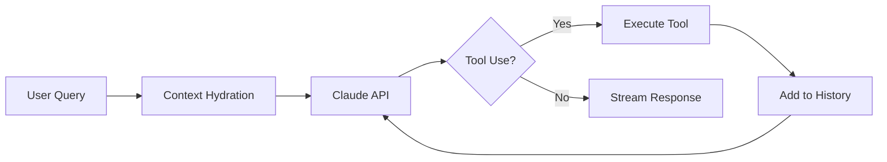
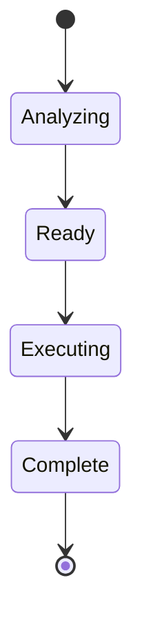
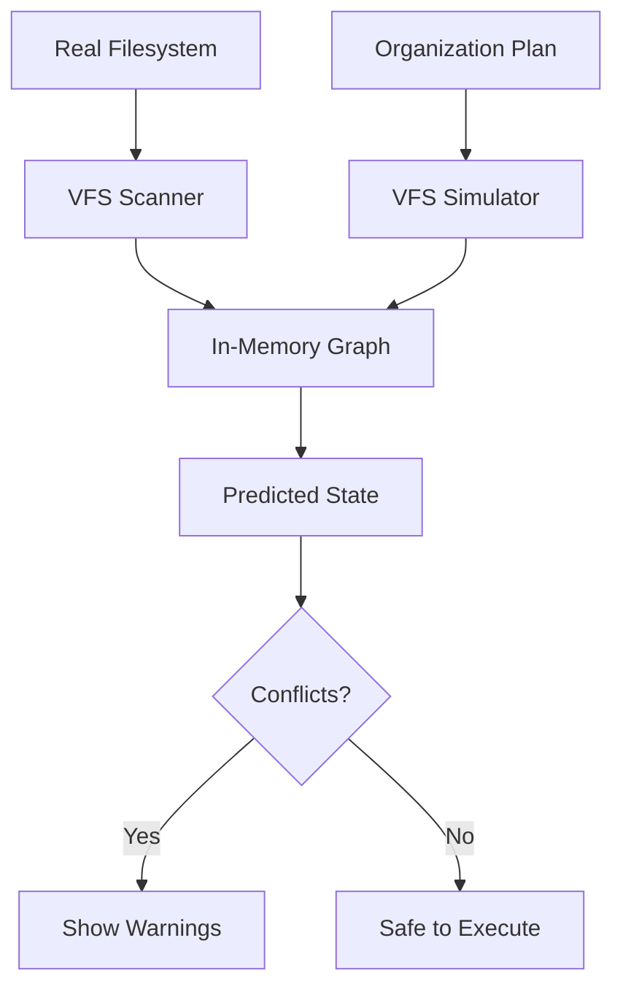
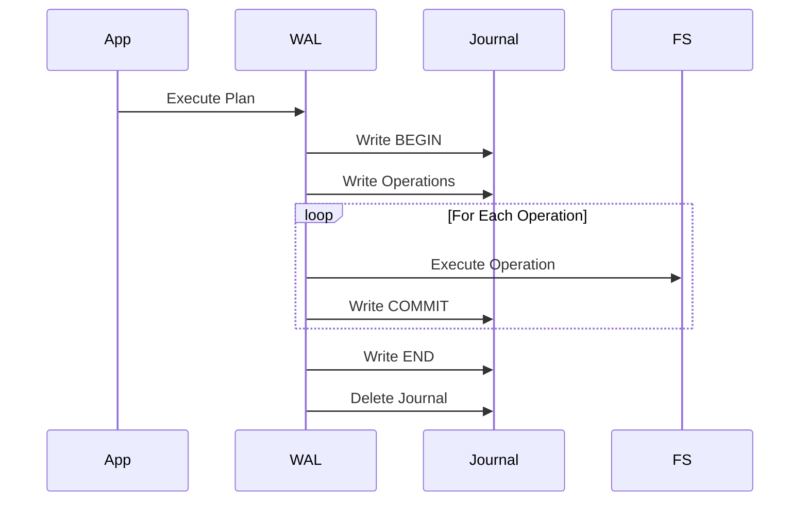
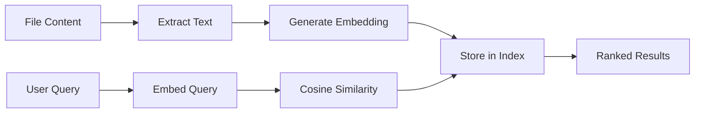
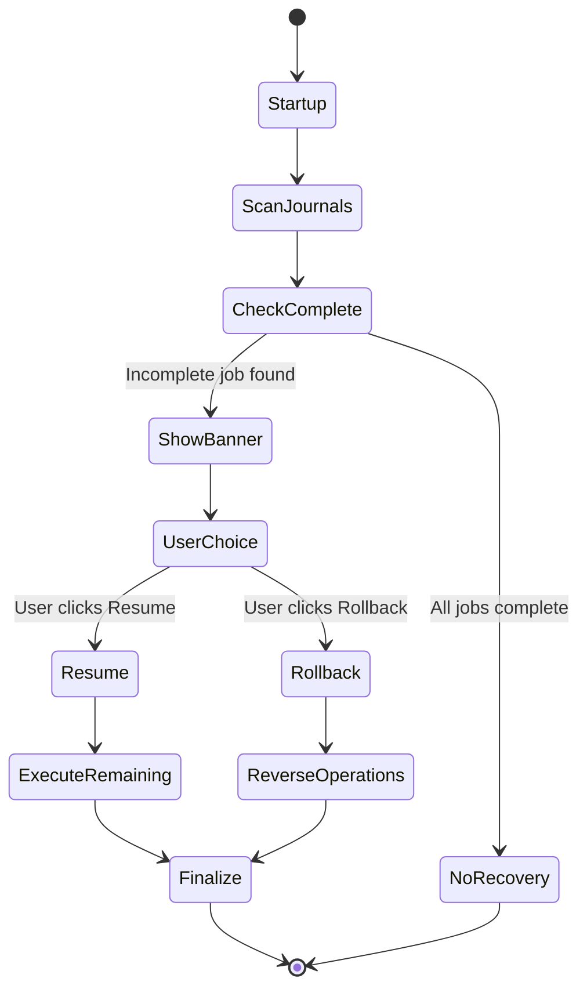

# Features Documentation

This document provides detailed explanations of Sentinel's key features, how they work, and how to use them effectively.

## Table of Contents

- [AI Chat Agent](#ai-chat-agent)
- [Organization System](#organization-system)
- [Virtual File System (VFS)](#virtual-file-system-vfs)
- [Write-Ahead Log (WAL)](#write-ahead-log-wal)
- [Vector Search](#vector-search)
- [Crash Recovery](#crash-recovery)
- [File Operations](#file-operations)

## AI Chat Agent

The Chat Agent uses the ReAct (Reason + Act) pattern to answer questions about your files intelligently.

### How It Works



### Features

#### 1. Streaming Responses

Real-time token streaming provides immediate feedback:

```typescript
// Frontend automatically handles streaming
await sendMessage('What files relate to taxes?');
// Response streams in real-time
```

**Implementation Details:**
- Token batching (16ms window) reduces IPC overhead by 90%
- SSE parsing with proper error handling
- Automatic reconnection on network issues

#### 2. Extended Thinking

Enable extended thinking for complex queries:

```typescript
useChatStore.setState({ extendedThinking: true });
await sendMessage('Analyze this folder and suggest an organization strategy');
```

**When to Use:**
- Complex reasoning tasks
- Multi-step analysis
- Strategic planning

**Token Budget:** 10,000 tokens for extended thinking

#### 3. Context Items (@mentions)

Attach specific files/folders for context:

```typescript
// Type @ in chat input to open mention dropdown
@Documents/taxes.pdf
```

**Strategies:**
- `hologram` - Compressed representation (fast, less detail)
- `read` - Full content (slower, more detail)
- `vision` - For images (uses vision API)

**Example:**
```
You: @Documents Can you summarize the contracts in this folder?

Sentinel: I found 12 contracts. Here's a summary:
  • Acme Corp (2024-01-15): $50,000 consulting agreement
  • Henderson LLC (2024-02-01): $75,000 development contract
  ...
```

#### 4. Available Tools

The agent can use these tools autonomously:

| Tool | Purpose | Example |
|------|---------|---------|
| `search_hybrid` | Find files by content/name | "Find all invoices from 2024" |
| `read_file` | Read file contents | "What's in contract.pdf?" |
| `inspect_pattern` | Find patterns | "Find all TODO comments" |
| `list_directory` | List folder contents | "What's in Downloads?" |

### Best Practices

**DO:**
- Use specific questions: "Find PDFs larger than 10MB created last month"
- Enable extended thinking for complex tasks
- Attach relevant context items

**DON'T:**
- Ask overly broad questions: "Tell me about my files"
- Attach too many context items (max 10)
- Disable extended thinking for complex reasoning

## Organization System

Autonomous file organization with AI-powered rule generation.

### Workflow



### Strategy Selection

Sentinel automatically chooses the best strategy based on folder size:

#### 1. Full Tree (<300 files)

**How it works:**
1. Scans entire directory
2. Generates compressed XML tree
3. Sends to Claude in one request
4. Returns complete organization plan

**Pros:**
- Simple and fast
- High accuracy
- Single API call

**Cons:**
- Limited to small folders

**Example:**
```xml
<directory name="Downloads">
  <file name="invoice_2024.pdf" size="123456" type="pdf"/>
  <file name="contract_acme.docx" size="234567" type="docx"/>
  <directory name="Photos">
    <file name="IMG_0001.jpg" size="345678" type="jpg"/>
  </directory>
</directory>
```

#### 2. Map-Reduce (300-5000 files)

**How it works:**
1. Strategic sampling (100 files per iteration)
2. Generate organization rules
3. Apply rules to all files
4. Repeat until 95% coverage

**Pros:**
- Scales to medium folders
- Iterative refinement
- Good accuracy

**Cons:**
- Multiple API calls
- Slower than full tree

**Example:**
```json
{
  "rules": [
    {
      "condition": "file.ext == 'pdf' AND file.name.contains('invoice')",
      "action": "move_to('Documents/Invoices')"
    },
    {
      "condition": "file.ext == 'jpg' AND file.size > 1000000",
      "action": "move_to('Photos/High-Res')"
    }
  ]
}
```

#### 3. Hologram (pattern-heavy folders)

**How it works:**
1. Detect repetitive patterns
2. Compress patterns adaptively
3. Send compressed representation
4. Expand rules to all files

**Pros:**
- Scales to very large folders
- 85-94% token reduction
- Fast analysis

**Cons:**
- Requires clear patterns
- May miss edge cases

**Example:**
```xml
<!-- Before: 10,000 tokens -->
<files>
  <file>IMG_0001.jpg</file>
  <file>IMG_0002.jpg</file>
  <!-- ... 9,998 more ... -->
</files>

<!-- After: 1,500 tokens (85% reduction) -->
<pattern value="IMG_####.jpg" count="10000" samples="IMG_0001.jpg,IMG_5000.jpg,IMG_9999.jpg"/>
```

### Organization Instructions

Effective instructions produce better results:

**Good Instructions:**
```
✅ "Organize by project, separate contracts and deliverables"
✅ "Group by file type: documents, images, media, and other"
✅ "Sort photos by date, create folders for each month"
✅ "Separate invoices by client and year"
```

**Bad Instructions:**
```
❌ "Organize my files" (too vague)
❌ "Make it better" (no clear goal)
❌ "Do something" (no direction)
```

### Plan Preview

Before execution, review the plan:

```typescript
const plan = await generatePlan(folder, instruction);

console.log(`Operations: ${plan.operations.length}`);
console.log(`New folders: ${plan.created_folders.length}`);
console.log(`Files moved: ${plan.stats.files_moved}`);
```

**What to check:**
- Number of operations (sanity check)
- New folder structure (makes sense?)
- Individual operations (correct destinations?)

### Editing Plans

Modify plans before execution:

```typescript
// Open plan editor
openPlanEditModal(plan);

// Edit operations
addOperation({ source: '/path/to/file', destination: '/new/path' });
removeOperation(operationId);
modifyOperation(operationId, { destination: '/updated/path' });

// Save and execute
savePlan();
executePlan();
```

## Virtual File System (VFS)

In-memory filesystem simulation for safe previews.

### Architecture



### Node States

Each VFS node has a state:

| State | Description | Color |
|-------|-------------|-------|
| `Original` | Unchanged from real FS | Default |
| `Created` | New in simulation | Green |
| `Modified` | Changed in simulation | Yellow |
| `Deleted` | Marked for deletion | Red |
| `MovedFrom` | Source of move | Blue |
| `MovedTo` | Destination of move | Purple |

### Conflict Detection

VFS detects conflicts before execution:

#### Path Collision

Multiple files moving to the same destination:

```
❌ CONFLICT: Path collision
  /old/file1.txt → /new/file.txt
  /old/file2.txt → /new/file.txt

  Solution: Rename one of the files
```

#### Circular Dependency

Operations that depend on each other:

```
❌ CONFLICT: Circular dependency
  Move /a/file → /b/file
  Move /b → /a

  Solution: Break the cycle
```

#### Missing Parent

Destination parent doesn't exist:

```
❌ CONFLICT: Missing parent
  Move file.txt → /new/folder/file.txt
  But /new/folder doesn't exist

  Solution: Create parent folder first
```

### VFS API

```typescript
// Simulate plan
const result = await invoke('vfs_simulate_plan', { plan });

// Check for conflicts
if (result.conflicts.length > 0) {
  console.warn('Conflicts:', result.conflicts);
}

// Explore predicted state
const node = result.nodes['/path/to/file'];
console.log(`State: ${node.state}`);
console.log(`New path: ${node.path}`);
```

## Write-Ahead Log (WAL)

Crash recovery through journaled operations.

### How It Works



### Journal Format

```json
{
  "job_id": "550e8400-e29b-41d4-a716-446655440000",
  "start_time": 1704067200,
  "operations": [
    {
      "index": 0,
      "op_type": "move",
      "source": "/old/path/file.txt",
      "destination": "/new/path/file.txt",
      "timestamp": 1704067201
    }
  ],
  "committed": [0],
  "finalized": false
}
```

### Recovery Scenarios

#### Scenario 1: Crash During Execution

```
Job started: 10 operations
Completed: 6 operations
Crash: Power loss

On restart:
1. Detect incomplete journal
2. Show recovery banner
3. User chooses: Resume or Rollback
4. Resume: Execute operations 7-10
5. Finalize journal
```

#### Scenario 2: Rollback

```
Job started: 10 operations
Completed: 6 operations
User cancels: Wants to undo

Rollback process:
1. Reverse operation 6
2. Reverse operation 5
3. ... continue in reverse order
4. Delete journal
```

### WAL API

```typescript
// Check for recovery on startup
const recovery = await invoke('wal_check_recovery');

if (recovery) {
  // Show recovery UI
  showRecoveryBanner(recovery);
}

// Resume interrupted job
await invoke('wal_resume_job', { jobId: recovery.job_id });

// Or rollback
await invoke('wal_rollback_job', { jobId: recovery.job_id });
```

## Vector Search

Semantic file search using local embeddings.

### How It Works



### Embedding Model

**Model:** BAAI/bge-small-en-v1.5
**Dimensions:** 384
**Language:** English (multilingual support coming)

### Supported File Types

| Type | Extraction Method |
|------|-------------------|
| `.txt` | Direct read |
| `.pdf` | pdf-extract crate |
| `.docx` | docx-rs crate |
| `.xlsx` | calamine crate |
| `.md` | Direct read |
| `.json` | Direct read |
| `.csv` | Direct read |

### Search Examples

#### Semantic Search

```typescript
// Find files by meaning, not just keywords
const results = await invoke('search_hybrid', {
  query: 'tax documents from 2024',
});

// Returns:
// - 2024_taxes.pdf (high similarity)
// - w2_form.pdf (high similarity)
// - 1099_contractor.pdf (high similarity)
// - vacation_photos.jpg (low similarity, filtered out)
```

#### Hybrid Search

Combines semantic and keyword search:

```typescript
const results = await invoke('search_hybrid', {
  query: 'invoice acme',
});

// Semantic: Files about invoices
// Keyword: Files containing "acme"
// Result: Invoices related to Acme Corp
```

### Performance

| File Count | Index Time | Search Time |
|------------|------------|-------------|
| 100 | ~2s | ~50ms |
| 1,000 | ~20s | ~100ms |
| 10,000 | ~3min | ~500ms |

**Optimization:** Embeddings are cached and only regenerated when files change.

## Crash Recovery

Automatic recovery from unexpected shutdowns.

### Recovery Flow



### Recovery UI

When an incomplete job is detected:

```
┌─────────────────────────────────────────────────┐
│  ⚠️  Recovery Available                         │
├─────────────────────────────────────────────────┤
│  An organization job was interrupted:           │
│                                                 │
│  Folder: /Users/me/Documents                    │
│  Started: 2024-01-01 14:30                      │
│  Progress: 42/100 operations complete           │
│                                                 │
│  [Resume]  [Rollback]  [Cancel]                │
└─────────────────────────────────────────────────┘
```

**Options:**
- **Resume:** Continue from where it left off
- **Rollback:** Undo completed operations
- **Cancel:** Ignore for now (can recover later)

### Safety Guarantees

1. **Atomicity:** Each operation either completes fully or not at all
2. **Durability:** Journal persists to disk before execution
3. **Consistency:** VFS validation before execution
4. **Isolation:** File locking prevents concurrent modifications

## File Operations

Core file operations with safety features.

### Move

```typescript
await invoke('move_files', {
  sources: ['/old/path/file.txt'],
  destination: '/new/path/',
});
```

**Safety Features:**
- VFS simulation before execution
- WAL journaling
- Conflict detection
- Parent directory auto-creation

### Copy

```typescript
await invoke('copy_files', {
  sources: ['/path/to/file.txt'],
  destination: '/backup/',
});
```

**Use Cases:**
- Backups
- Duplicating files
- Templates

### Delete

```typescript
await invoke('delete_files', {
  paths: ['/path/to/file.txt'],
});
```

**Safety Features:**
- Moves to system trash (not permanent delete)
- Requires confirmation
- Undo support (restore from trash)

### Rename

```typescript
await invoke('rename_file', {
  path: '/path/to/old_name.txt',
  newName: 'new_name.txt',
});
```

**AI-Powered Suggestions:**
```typescript
const suggestion = await invoke('get_rename_suggestion', {
  path: '/path/to/IMG_0001.jpg',
  context: 'Hawaii vacation December 2024',
});
// Returns: "hawaii_vacation_dec_2024_01.jpg"
```

### Batch Operations

Execute multiple operations efficiently:

```typescript
await invoke('execute_plan_parallel', {
  operations: [
    { op_type: 'move', source: '/a', destination: '/b' },
    { op_type: 'move', source: '/c', destination: '/d' },
    { op_type: 'copy', source: '/e', destination: '/f' },
  ],
});
```

**Features:**
- Parallel execution (respects dependencies)
- Progress events
- Error handling (continues on individual failures)
- WAL journaling

## Performance Tips

### Chat Agent

1. **Use specific queries** - Faster tool execution
2. **Limit context items** - Reduces processing time
3. **Disable extended thinking** for simple questions

### Organization

1. **Clean folders first** - Remove unnecessary files
2. **Use clear instructions** - Better AI understanding
3. **Preview before executing** - Catch issues early

### Vector Search

1. **Index during idle time** - Background processing
2. **Use file type filters** - Narrows search space
3. **Combine with keywords** - Hybrid search is faster

## See Also

- [Getting Started Guide](../getting-started.md)
- [API Reference](../api/README.md)
- [Architecture Overview](../architecture.md)
