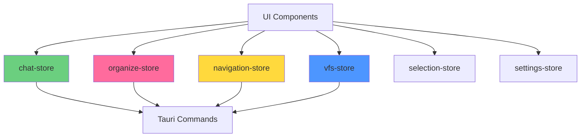
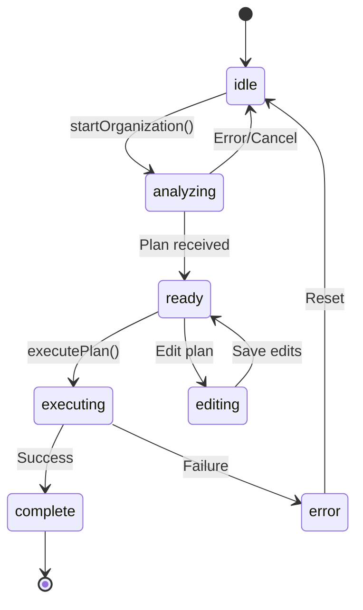
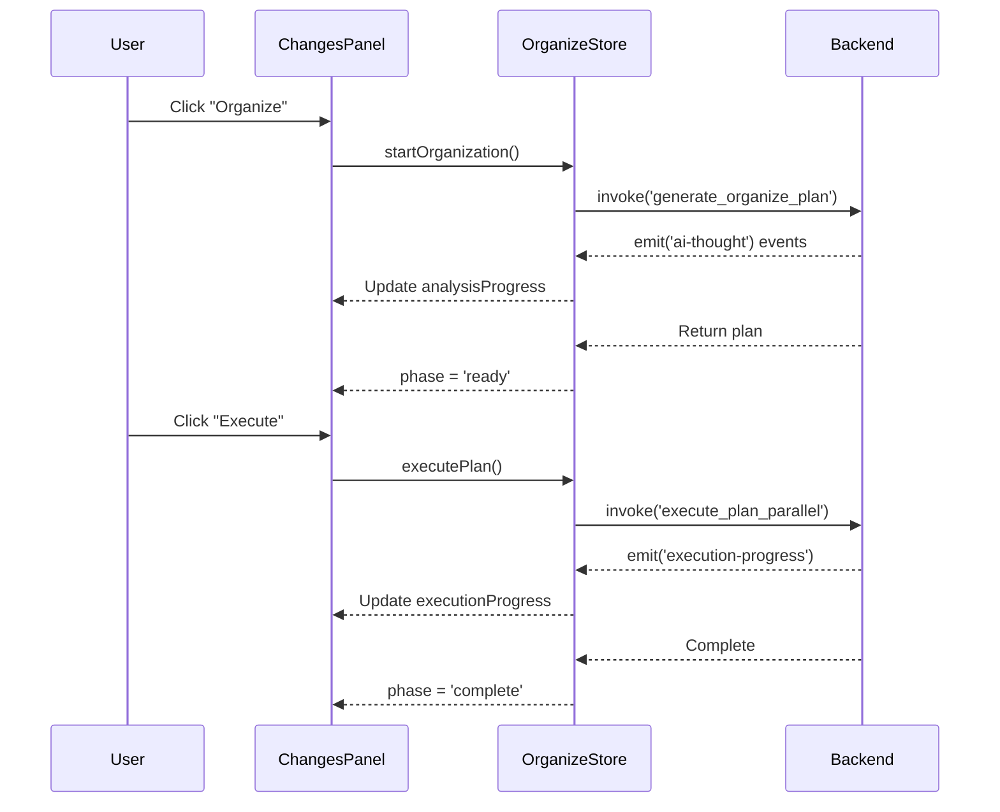

# Frontend Documentation

This document covers Sentinel's React 19 frontend architecture, including components, state management, hooks, and UI patterns.

## Technology Stack

| Technology | Version | Purpose |
|------------|---------|---------|
| React | 19.1 | UI framework with concurrent features |
| TypeScript | 5.8 | Type safety and developer experience |
| Vite | 7.0 | Build tool with fast HMR |
| TailwindCSS | 4.1 | Utility-first styling |
| Zustand | 5.0 | Lightweight state management |
| TanStack Query | 5.90 | Server state management |
| TanStack Virtual | 3.13 | Virtual scrolling for large lists |

## Project Structure

```
src/
├── components/          # React components
│   ├── ChatPanel/      # AI chat interface
│   ├── ChangesPanel/   # Organization workflow UI
│   ├── file-list/      # File browser views
│   ├── PlanEditModal/  # Plan editing interface
│   ├── dialogs/        # Modal dialogs
│   ├── ghost/          # File operation animations
│   └── layout/         # Layout components
│
├── stores/             # Zustand state stores
│   ├── organize/       # Organization sub-stores
│   ├── chat-store.ts
│   ├── navigation-store.ts
│   └── vfs-store.ts
│
├── hooks/              # Custom React hooks
│   ├── useFileSystem.ts
│   ├── useKeyboard.ts
│   └── useDragDrop.ts
│
├── types/              # TypeScript type definitions
│   ├── file.ts
│   ├── vfs.ts
│   └── ghost.ts
│
└── lib/                # Utilities and helpers
    ├── query-client.ts
    ├── tauri.ts
    └── format.ts
```

## State Management

Sentinel uses Zustand for state management with domain-specific stores. Each store manages a distinct area of functionality.

### Store Architecture



### Core Stores

#### 1. `chat-store.ts`

Manages AI chat interface state and streaming.

```typescript
interface ChatState {
  // Panel state
  isOpen: boolean;
  width: number;

  // Conversation
  messages: ChatMessage[];
  activeContext: ContextItem[];

  // Model & status
  model: ChatModel;
  status: ChatStatus; // 'idle' | 'thinking' | 'streaming' | 'error'
  extendedThinking: boolean;

  // Streaming
  currentStreamId: string | null;

  // Actions
  sendMessage: (content: string) => Promise<void>;
  togglePanel: () => void;
  setModel: (model: ChatModel) => void;
  addContextItem: (item: ContextItem) => void;
}
```

**Key Features:**
- Streaming message updates via Tauri events
- Extended thinking mode (Claude's internal reasoning)
- Context item management (@mentions)
- Auto-recovery from errors
- Message persistence

**Example Usage:**
```typescript
import { useChatStore } from '@/stores/chat-store';

function ChatPanel() {
  const { messages, sendMessage, status } = useChatStore();

  const handleSend = async (text: string) => {
    await sendMessage(text);
  };

  return (
    <div>
      {messages.map(msg => (
        <MessageItem key={msg.id} message={msg} />
      ))}
      {status === 'streaming' && <StreamingIndicator />}
    </div>
  );
}
```

#### 2. `organize-store.ts`

Complex state machine managing the organization workflow.

```typescript
interface OrganizeState {
  // UI state
  isOpen: boolean;
  targetFolder: string | null;

  // Phase state machine
  phase: OrganizePhase; // 'idle' | 'analyzing' | 'ready' | 'executing' | 'complete'

  // Plan state
  currentPlan: OrganizePlan | null;
  analysisProgress: AnalysisProgressState | null;

  // Execution state
  executionProgress: ExecutionProgressState | null;
  executedOps: string[];

  // Recovery
  currentJobId: string | null;
  isOfflineMode: boolean;

  // Actions
  startOrganization: (folder: string, instruction: string) => Promise<void>;
  executePlan: () => Promise<void>;
  cancelAnalysis: () => void;
}
```

**Phase State Machine:**


**Example Usage:**
```typescript
import { useOrganizeStore } from '@/stores/organize-store';

function OrganizeButton() {
  const { startOrganization, phase } = useOrganizeStore();

  const handleClick = async () => {
    await startOrganization(
      '/Users/me/Documents',
      'Organize by project and separate invoices'
    );
  };

  return (
    <button onClick={handleClick} disabled={phase !== 'idle'}>
      {phase === 'analyzing' ? 'Analyzing...' : 'Organize'}
    </button>
  );
}
```

#### 3. `navigation-store.ts`

Manages directory navigation and view state.

```typescript
interface NavigationState {
  currentDir: string;
  history: string[];
  historyIndex: number;
  viewMode: 'grid' | 'list' | 'columns';
  sortBy: SortField;
  sortOrder: 'asc' | 'desc';

  // Actions
  navigateTo: (path: string) => void;
  goBack: () => void;
  goForward: () => void;
  setViewMode: (mode: ViewMode) => void;
}
```

#### 4. `vfs-store.ts`

Virtual filesystem preview state.

```typescript
interface VfsState {
  nodes: Map<string, VfsNode>;
  isActive: boolean;
  conflicts: Conflict[];

  // Actions
  simulatePlan: (plan: OrganizePlan) => Promise<void>;
  reset: () => void;
  getNode: (path: string) => VfsNode | undefined;
}
```

#### 5. `selection-store.ts`

Multi-file selection state.

```typescript
interface SelectionState {
  selectedPaths: Set<string>;
  lastSelectedPath: string | null;
  isSelecting: boolean;

  // Actions
  selectFile: (path: string, multi?: boolean) => void;
  selectRange: (startPath: string, endPath: string) => void;
  clearSelection: () => void;
}
```

### Store Best Practices

1. **Use shallow equality for derived state:**
```typescript
const { messages, status } = useChatStore(
  useShallow((state) => ({
    messages: state.messages,
    status: state.status,
  }))
);
```

2. **Split large stores into sub-stores:**
```typescript
// organize-store.ts uses sub-stores
import { usePlanStore } from './organize/plan-store';
import { useExecutionStore } from './organize/execution-store';
import { useThinkingStore } from './organize/thinking-store';
```

3. **Persist important state:**
```typescript
export const useSettingsStore = create<SettingsState>()(
  persist(
    (set) => ({
      theme: 'system',
      defaultModel: 'claude-sonnet-4.5',
      // ...
    }),
    {
      name: 'sentinel-settings',
    }
  )
);
```

## Component Architecture

### Component Patterns

#### 1. Presentational vs Container Components

**Presentational** (pure, no state):
```typescript
interface MessageItemProps {
  message: ChatMessage;
  onRetry?: () => void;
}

export function MessageItem({ message, onRetry }: MessageItemProps) {
  return (
    <div className="message">
      <div className="content">{message.content}</div>
      {message.thoughts && <ThoughtAccordion thoughts={message.thoughts} />}
    </div>
  );
}
```

**Container** (connects to stores):
```typescript
export function MessageList() {
  const messages = useChatStore((state) => state.messages);

  return (
    <div className="message-list">
      {messages.map((msg) => (
        <MessageItem key={msg.id} message={msg} />
      ))}
    </div>
  );
}
```

#### 2. Compound Components

Use for complex UI with shared state:

```typescript
// PlanEditModal uses compound pattern
export function PlanEditModal() {
  return (
    <Dialog>
      <PlanEditToolbar />
      <PlanEditContent>
        <OperationList />
        <OperationDetails />
      </PlanEditContent>
    </Dialog>
  );
}
```

#### 3. Render Props

For flexible, reusable logic:

```typescript
interface VirtualListProps<T> {
  items: T[];
  renderItem: (item: T, index: number) => React.ReactNode;
}

export function VirtualList<T>({ items, renderItem }: VirtualListProps<T>) {
  const virtualizer = useVirtualizer({
    count: items.length,
    getScrollElement: () => parentRef.current,
    estimateSize: () => 48,
  });

  return (
    <div ref={parentRef}>
      {virtualizer.getVirtualItems().map((virtualRow) => (
        <div key={virtualRow.key} data-index={virtualRow.index}>
          {renderItem(items[virtualRow.index], virtualRow.index)}
        </div>
      ))}
    </div>
  );
}
```

### Key Components

#### ChatPanel

AI chat interface with streaming, extended thinking, and @mentions.

**Location**: `src/components/ChatPanel/`

**Sub-components:**
- `MessageList.tsx` - Scrollable message container
- `MessageItem.tsx` - Individual message with thoughts
- `ChatInput.tsx` - Input with model selector and mentions
- `ThoughtAccordion.tsx` - Expandable tool execution display
- `StreamingIndicator.tsx` - Visual feedback during streaming

**Features:**
- Real-time streaming via Tauri events
- Extended thinking visualization
- @mention autocomplete for files/folders
- Context strategy selection (hologram/read/vision)
- Message retry on errors

#### ChangesPanel

Organization workflow UI showing analysis, preview, and execution.

**Location**: `src/components/ChangesPanel/`

**Sub-components:**
- `PhaseIndicator.tsx` - Visual phase state machine
- `AnalysisProgressBar.tsx` - AI analysis progress
- `PlanPreview.tsx` - Organization plan visualization
- `ExecutionProgress.tsx` - Real-time execution updates
- `DynamicStatus.tsx` - Contextual status messages

**State Flow:**


#### File Views

Three view modes with unified interfaces.

**Location**: `src/components/file-list/`

**Components:**
- `FileGridView.tsx` - Thumbnail grid (Pinterest-style)
- `FileListView.tsx` - Compact list with details
- `FileColumnsView.tsx` - Miller columns (macOS Finder)

**Shared Features:**
- Virtual scrolling for performance
- Drag-and-drop support
- Multi-selection
- Context menus
- Thumbnail generation

**Example - FileGridView:**
```typescript
export function FileGridView({ files }: { files: FileEntry[] }) {
  const virtualizer = useVirtualizer({
    count: Math.ceil(files.length / COLUMNS),
    getScrollElement: () => parentRef.current,
    estimateSize: () => GRID_ROW_HEIGHT,
  });

  return (
    <div ref={parentRef} className="file-grid">
      {virtualizer.getVirtualItems().map((virtualRow) => {
        const startIdx = virtualRow.index * COLUMNS;
        const rowFiles = files.slice(startIdx, startIdx + COLUMNS);

        return (
          <div key={virtualRow.key} className="grid-row">
            {rowFiles.map((file) => (
              <FileGridItem key={file.path} file={file} />
            ))}
          </div>
        );
      })}
    </div>
  );
}
```

## Custom Hooks

### Filesystem Hooks

#### `useFileSystem`

Access filesystem operations via Tauri.

```typescript
export function useFileSystem() {
  const queryClient = useQueryClient();

  const listDirectory = async (path: string): Promise<FileEntry[]> => {
    return await invoke('list_directory', { path });
  };

  const deleteFiles = async (paths: string[]): Promise<void> => {
    await invoke('delete_files', { paths });
    queryClient.invalidateQueries(['files']);
  };

  return { listDirectory, deleteFiles };
}
```

#### `useDirectoryWatch`

Watch directory changes in real-time.

```typescript
export function useDirectoryWatch(path: string) {
  const [files, setFiles] = useState<FileEntry[]>([]);

  useEffect(() => {
    const unlisten = listen<FileChangeEvent>('fs:change', (event) => {
      if (event.payload.path.startsWith(path)) {
        // Refresh file list
        queryClient.invalidateQueries(['files', path]);
      }
    });

    return () => {
      unlisten.then((fn) => fn());
    };
  }, [path]);

  return files;
}
```

### UI Hooks

#### `useKeyboard`

Global keyboard shortcuts.

```typescript
export function useKeyboard(shortcuts: Record<string, () => void>) {
  useEffect(() => {
    const handler = (e: KeyboardEvent) => {
      const key = [
        e.ctrlKey && 'ctrl',
        e.metaKey && 'cmd',
        e.shiftKey && 'shift',
        e.key.toLowerCase(),
      ]
        .filter(Boolean)
        .join('+');

      shortcuts[key]?.();
    };

    window.addEventListener('keydown', handler);
    return () => window.removeEventListener('keydown', handler);
  }, [shortcuts]);
}

// Usage
useKeyboard({
  'cmd+1': () => setViewMode('grid'),
  'cmd+2': () => setViewMode('list'),
  'cmd+3': () => setViewMode('columns'),
  'cmd+o': () => openFolderDialog(),
});
```

#### `useDragDrop`

Drag-and-drop file operations.

```typescript
export function useDragDrop(onDrop: (files: FileEntry[], target: string) => void) {
  const [isDragging, setIsDragging] = useState(false);

  const handleDragStart = (e: DragEvent, files: FileEntry[]) => {
    e.dataTransfer!.effectAllowed = 'move';
    e.dataTransfer!.setData('application/sentinel-files', JSON.stringify(files));
    setIsDragging(true);
  };

  const handleDrop = (e: DragEvent, target: string) => {
    e.preventDefault();
    const data = e.dataTransfer!.getData('application/sentinel-files');
    const files = JSON.parse(data) as FileEntry[];
    onDrop(files, target);
    setIsDragging(false);
  };

  return { isDragging, handleDragStart, handleDrop };
}
```

## Event Handling

### Tauri Events

Frontend listens to backend events for real-time updates:

| Event | Payload | Purpose |
|-------|---------|---------|
| `chat:token` | `{ content: string }` | Streaming chat token |
| `chat:thinking` | `{ content: string }` | Extended thinking update |
| `chat:thought` | `ThoughtStep` | Tool execution step |
| `ai-thought` | `AIThought` | Organization agent progress |
| `execution-progress` | `ExecutionProgressState` | Plan execution update |

**Example - Listening to events:**
```typescript
useEffect(() => {
  const unlisten = listen<{ content: string }>('chat:token', (event) => {
    appendToMessage(event.payload.content);
  });

  return () => {
    unlisten.then((fn) => fn());
  };
}, []);
```

## Styling

### TailwindCSS Utilities

Sentinel uses TailwindCSS v4 with custom configuration:

**Color Palette:**
```css
/* Primary */
--color-primary: #6366f1;
--color-primary-hover: #4f46e5;

/* Surfaces */
--color-bg-primary: #ffffff;
--color-bg-secondary: #f9fafb;
--color-bg-tertiary: #f3f4f6;

/* Text */
--color-text-primary: #111827;
--color-text-secondary: #6b7280;
--color-text-tertiary: #9ca3af;
```

**Common Patterns:**
```typescript
// Card
<div className="rounded-lg border border-gray-200 bg-white p-4 shadow-sm">

// Button (primary)
<button className="rounded-md bg-primary px-4 py-2 text-white hover:bg-primary-hover">

// Input
<input className="rounded-md border border-gray-300 px-3 py-2 focus:ring-2 focus:ring-primary">
```

### Dark Mode

Coming soon - CSS variables enable easy theme switching.

## Performance Optimization

### 1. Virtual Scrolling

For large file lists:

```typescript
import { useVirtualizer } from '@tanstack/react-virtual';

const virtualizer = useVirtualizer({
  count: files.length,
  getScrollElement: () => parentRef.current,
  estimateSize: () => 48,
  overscan: 5, // Render 5 extra rows for smooth scrolling
});
```

### 2. Memoization

Prevent unnecessary re-renders:

```typescript
export const MessageItem = React.memo(({ message }: MessageItemProps) => {
  // Only re-renders when message changes
  return <div>{message.content}</div>;
});

// Or use useMemo for expensive calculations
const sortedFiles = useMemo(() => {
  return files.sort((a, b) => a.name.localeCompare(b.name));
}, [files]);
```

### 3. Code Splitting

Lazy load heavy components:

```typescript
const PlanEditModal = lazy(() => import('@/components/PlanEditModal'));

// Use with Suspense
<Suspense fallback={<LoadingSpinner />}>
  {showModal && <PlanEditModal />}
</Suspense>
```

## Testing

### Component Tests

```typescript
import { render, screen, fireEvent } from '@testing-library/react';
import { describe, it, expect } from 'vitest';
import { ChatInput } from './ChatInput';

describe('ChatInput', () => {
  it('sends message on enter', async () => {
    const onSend = vi.fn();
    render(<ChatInput onSend={onSend} />);

    const input = screen.getByPlaceholderText(/type a message/i);
    fireEvent.change(input, { target: { value: 'Hello' } });
    fireEvent.keyDown(input, { key: 'Enter' });

    expect(onSend).toHaveBeenCalledWith('Hello');
  });
});
```

### Store Tests

```typescript
import { renderHook, act } from '@testing-library/react';
import { useChatStore } from './chat-store';

describe('chat-store', () => {
  it('adds messages correctly', () => {
    const { result } = renderHook(() => useChatStore());

    act(() => {
      result.current.sendMessage('Test message');
    });

    expect(result.current.messages).toHaveLength(2); // User + assistant
  });
});
```

## See Also

- [Backend Documentation](../backend/README.md)
- [API Reference](../api/README.md)
- [Contributing Guide](../contributing.md)
